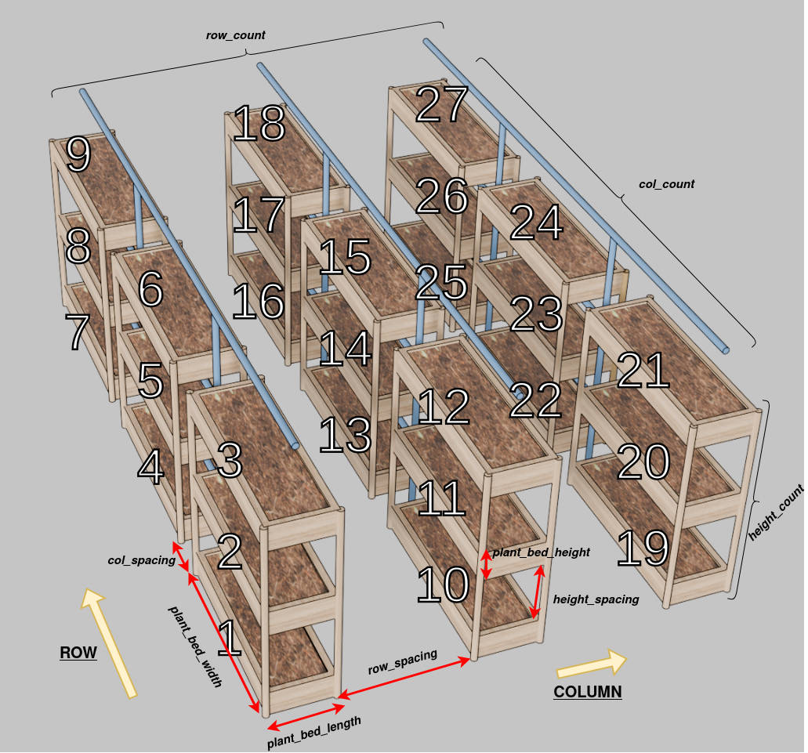
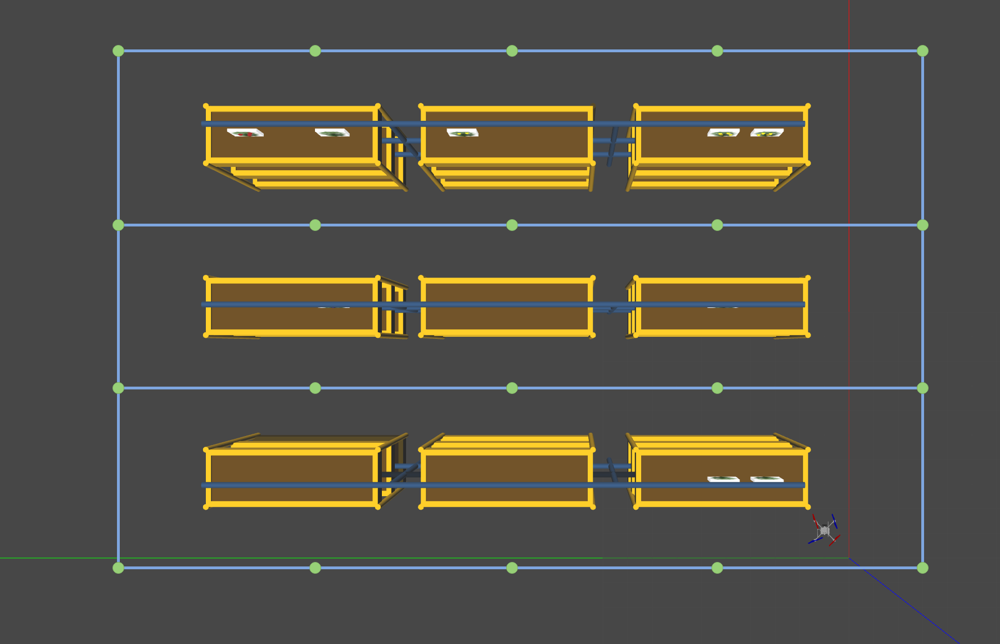

# Graph Generation

This document describes how the graph (or map) is generated from the environment. 

## Input parameters
- `row_count`: The number of rows of plant beds.
- `col_count`: The number of columns of plant beds.
- `height_count`: The number of levels of plant beds.
- `plant_bed_width`: The width of each plant bed. Width is the row direction.
- `plant_bed_length`: The length of each plant bed. Length is the column direction.
- `plant_bed_height`: The height of each plant bed. Height is the vertical direction.
- `row_spacing`: The spacing between each row of plant beds.
- `col_spacing`: The spacing between each column of plant beds.
- `height_spacing`: The spacing between each level of plant beds.
- `x_offset`: The x offset of the indoor farm from the origin (0, 0, 0).
- `y_offset`: The y offset of the indoor farm from the origin (0, 0, 0).
- `z_offset`: The z offset of the indoor farm from the origin (0, 0, 0).
- `safety_distance`: The safety distance between the drone and the plant bed.

## Output parameters

### NODE:

Message description:

| name | type | description |
| ---- | ---- | ------- |
| `uuid` | uint8 | The id of the node. |
| `position` | geometry_msgs/Position | The position of the node (X, Y, Z). |
| `id_list` | uint8[] | The list of ids of the plant beds in the node. |

### GRAPH:

Message description:

| name | type | description |
| ---- | ---- | ------- |
| `relationship_matrix` | float32[][] | Distance between nodes UUID. `nan` if not connected. |

